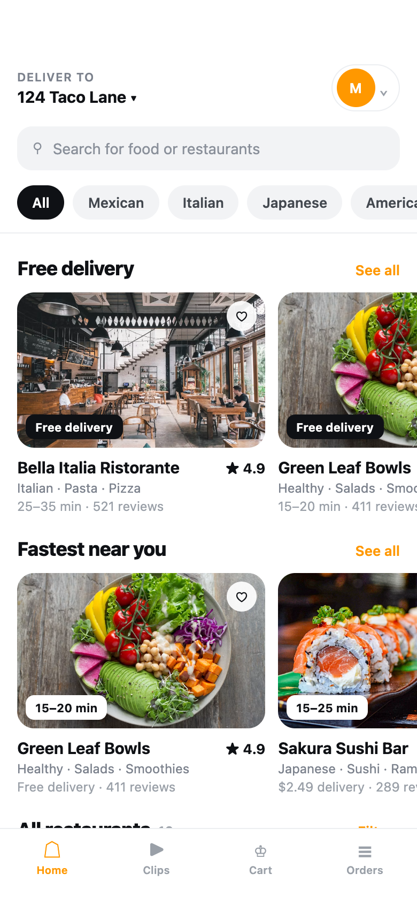
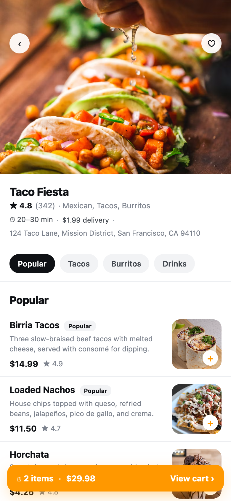
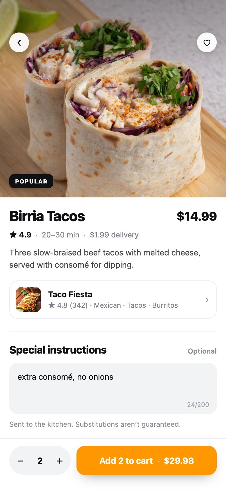
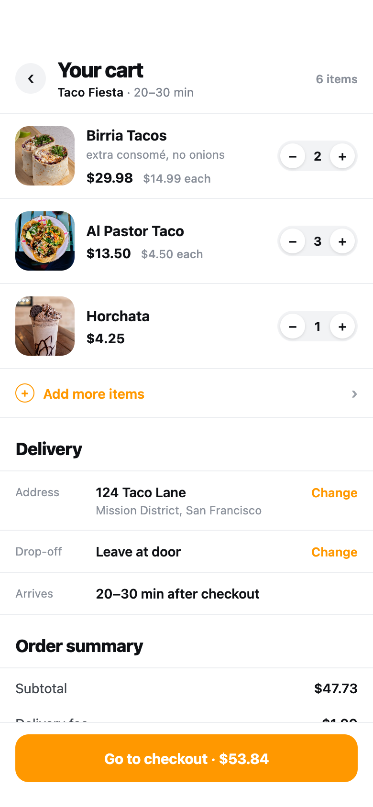
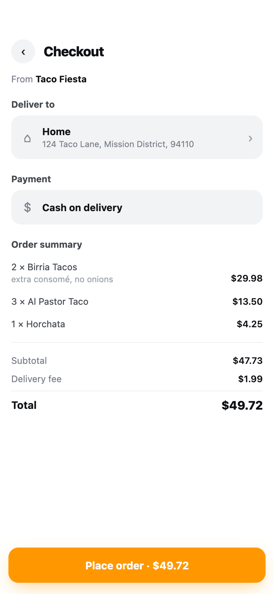
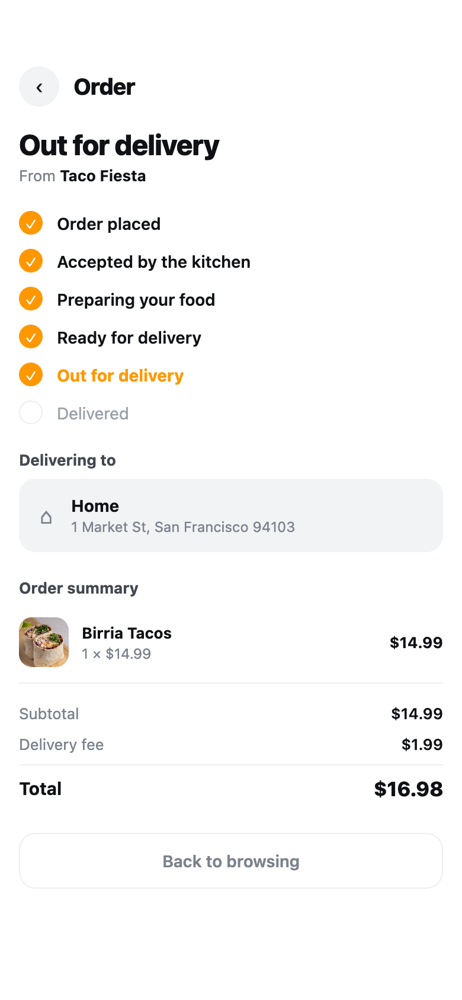

# Mockups

Browser-viewable design mockups. Not production code — the app itself is
React Native; these exist to make design decisions cheap to see and argue
about. Serve the folder and open on a phone or in devtools mobile view:

```
python3 -m http.server 4173 --directory mockups
```

## home-directions/ — the wheel

Ten Home-screen directions, switchable via `?variant=` (arrows or the pill).
All render real content from `mocks/db.json`.

| key | name         | fabric                                      |
| --- | ------------ | ------------------------------------------- |
| B   | Marketplace  | white, dense, carousels + grid — **chosen** |
| C   | Clips first  | full-bleed snapping video feed              |
| D   | Dish first   | dark 2-up dish grid, restaurant demoted     |
| F   | Clips + list | clip hero over a scannable sheet            |
| H   | Gallery      | pure typography, no cards                   |
| I   | Decided      | one recommendation, rest behind a link      |
| J   | Ask          | the app converses and justifies picks       |
| K   | Tonight      | pick the arrival time, food follows         |
| L   | The Block    | night map, kitchens as lit windows          |
| M   | One          | one dish at a time — PASS / EAT             |

Cut along the way: A (editorial serif), E (single column), G (ad-vs-arrived
proof cards).

**Decision: B** for the app's design language (2026-08-03). The brand colour
is NOT settled — `#FF9800` everywhere is scaffolding.

## app-b/ — B through the app

The chosen language applied to the four screens that stress it most, all
built on real `db.json` content for Taco Fiesta. Switch with `?screen=`.

| screen     | what it stresses                                                        |
| ---------- | ----------------------------------------------------------------------- |
| Home       | the reference implementation of variant B                               |
| Restaurant | sticky category rail, dish rows, ours-vs-theirs clip shelf              |
| Dish       | quantity + instructions, paired clips, a real review                    |
| Cart       | line items with instructions, delivery block, tax-correct totals        |
| Checkout   | deliver-to + cash-on-delivery cards, order summary, place order         |
| Order      | real order-seed-1 content, status timeline held at a mid-progress state |

Palette is closed to exactly B's eight tokens (`#fff #0f1115 #7c828d #8a909a
#9aa0a8 #eceef1 #f2f3f5 #43484f`) plus `var(--brand)` for accent — nothing
else. Radii, type scale and spacing all trace back to the chosen variant.

### Screenshots

| Home                                | Restaurant                                      | Dish                                |
| ----------------------------------- | ----------------------------------------------- | ----------------------------------- |
|  |  |  |

| Cart                                | Checkout                                    | Order                                 |
| ----------------------------------- | ------------------------------------------- | ------------------------------------- |
|  |  |  |
